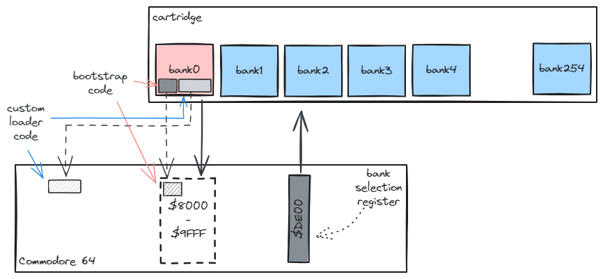

# Magic-Desk-CRT

[](https://dl.circleci.com/status-badge/redirect/gh/c64lib/magic-desk-crt/tree/main)
[](https://dl.circleci.com/status-badge/redirect/gh/c64lib/magic-desk-crt/tree/develop)
[](https://opensource.org/licenses/MIT)

The Magic-Desk-CRT project is designed to facilitate the loading of data from Commodore 64 (C64) cartridges that utilize the Magic Desk format.
This format is a popular method for distributing C64 software, allowing for multiple programs to be stored on a single cartridge.
The project provides a set of assembly libraries and examples to work with Magic Desk formatted cartridges, making it easier for developers to create or manipulate C64 software in this format.

## Purpose

The primary purpose of the Magic-Desk-CRT project is to provide a comprehensive toolkit for dealing with Magic Desk cartridges on the C64.
This includes functionalities for loading data from cartridges into the C64's memory, handling different banks of a cartridge, and setting up the environment for the loaded programs to run correctly.

The library is designed to be used with KickAssembler, a popular cross-assembler for the Commodore 64.
It provides macros and assembly files that can be easily integrated into KickAssembler projects, making it convenient for developers to work with Magic Desk cartridges.

Please note that the Magic-Desk-CRT project is a part of the c64lib project, which aims to provide a collection of libraries and tools for C64 development. 
Contributions and feedback are welcome to help improve the project and make it more useful for the C64 community.

## How to build the project

You need to have Java 17+ installed on your machine.
Optionally you need to have a `vice` binaries (prominently `cartconv` command) if you want to build examples.

To build the project type:

```
gradlew build
```

from the root folder of the project using a command line.
If you would like to build examples as well, type:

```
gradlew build-crt
```

from the root folder of the project.

## Key Components

- **Bootstrap**: The bootstrap component (`lib/bootstrap.asm`) initializes the C64 system and prepares it for loading data from the cartridge. It sets up the necessary hardware registers and memory configurations.

- **Loader**: The loader component (`lib/loader.asm`) is responsible for the actual loading of data from the cartridge into the C64's memory. It handles bank switching and ensures that data is loaded to the correct memory locations.

## Usage Instructions

1. **Setting Up**: Include the bootstrap and loader assembly files in your project. These files are located in the `lib` directory. If you use `Retro Build Tool`, you can easily include this library as a dependency to your project.

2. **Initialization**: Use the `createMagicDeskBootstrap` macro to initialize the bootstrap process. You will need to specify parameters such as the loader code size, source address, and target address. The bootstrap code must be placed at the beginning of the BANK 0, that is, the first bank of the cartridge image. The goal of the bootstrap code is to copy the rest of the BANK 0 under desired location and jump there at the end. The rest of the BANK 0 should contain a custom loader code responsible for selecting and loading desired other banks under relevant target memory location. The bootstrap code is designed not to contain any self modyfing code nor variables and require 3 additional two-byte writable memory location (two of them on a zero page). These memory locations can be specified as macro parameters.

3. **Loading Data**: To load data from the cartridge, use the `createMagicDeskLoader` macro. This sets up the loader with jump table labels for setting the target memory address and loading data.

4. **Examples**: The `examples` folder contains sample projects demonstrating how to use the library to load data from Magic Desk cartridges. These examples provide a practical guide to getting started with your own projects.

## About Magic Desk Format

The Magic Desk format is a cartridge format for the Commodore 64 that allows for multiple programs to be stored and accessed from a single cartridge. It utilizes bank switching to expand the available storage beyond the C64's native memory limits, enabling a rich and diverse software library to be distributed on a single cartridge.

For more information on the Magic Desk format and how to utilize it in your projects, refer to the examples provided in this repository.

## How does magic-desk-crt loader work?



This library comes with two parts.
The `bootstrap` part generates a valid CBM80 signature and an initialization & copying code that starts right after powering up C64 with cart plugged in.
The boostrap code must be placed at BANK 0 of the cartridge and must be compiled for an address space starting at `$8000`.

The remaining part of the BANK 0 can be then filled with custom loader code that contains a loading logic for your software (can be a collection of runnable PRG files or multipart game designed for cartridge).

The custom loader can be copied into any part of Commodore 64 address space except I/O area (`$D000`-`$DFFF`).
The custom loader logic should use magic desk loader code specified in `lib/loader.asm`.
The cartridge itself can be treated as a file system divided into "slots" where each slot can contain up to 8KiB data.
If more than 8KiB must be keept, it must be allocated into a continous set of 8KiB banks, identified by the number of the first bank.
The `lib/loader.asm` subroutine can be then used to load a specified number of bytes from given bank (identified by starting bank number) and copy it under specified location (any location except I/O space can be used as a target).

Both soubroutines (bootstrap, loader) are created by executing a macro (`createMagicDeskBootstrap()`, `createMagicDeskLoader()`, respectively).

The bootstrap macro is parametrized so developer decides which zero page memory locations to use, how big the custom loader is and where should it be relocated.

The loader macro does not take any parameters. Instead it should be called next to the named KickAss label, like this:

```
mdLoader: createMagicDeskLoader()
```

It is then possible to access two subroutines that are defined by the loader:

```
ldx #<target
lda #>target
jsr mdLoader.setTarget
```

to specify target address and 

```
lda #bank_number
ldx #<block-size
ldy #>block-size
jsr mdLoader.copy
```

to load a "file" starting from bank `bank_number`, with size `block-size` and place it in C64 memory starting from `target`.

You have to ensure that memory layout of C64 is configured properly so that cartridge is visible (i.e. by using BASIC/IO/KERNAL layout).

